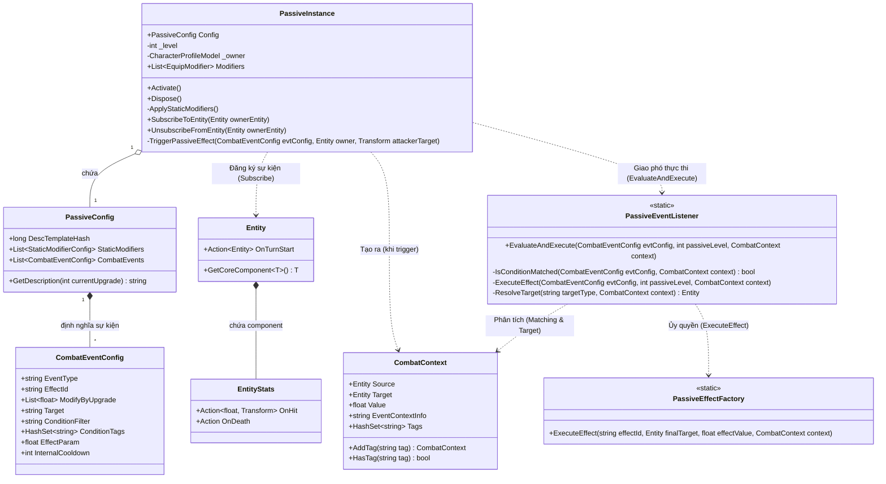

# Biểu đồ lớp cho PassiveInstance

Dưới đây là biểu đồ mô tả cấu trúc và luồng hoạt động của `PassiveInstance` cùng với các thành phần liên quan. Biểu đồ này giúp bạn hình dung được cách mà hệ thống Passive (Kỹ năng bị động) được nạp, cấu hình, bắt sự kiện và thực thi hiệu ứng trong trò chơi.

### Luồng hoạt động chính của PassiveInstance:

1. **Khởi tạo & Cấp chỉ số tĩnh (`Activate`)**: 
   - `PassiveInstance` nhận `PassiveConfig` và `Level`.
   - Lấy các chỉ số tĩnh (`StaticModifiers`) từ cấu hình và biến thành `EquipModifier` để cộng trực tiếp vào nhân vật.
   
2. **Đăng ký sự kiện (`SubscribeToEntity`)**:
   - `PassiveInstance` lắng nghe các sự kiện từ `Entity` chủ (ví dụ: `OnTurnStart` của `Entity`, hoặc `OnHit`, `OnDeath` của `EntityStats`).
   
3. **Kích hoạt sự kiện (`TriggerPassiveEffect`)**:
   - Khi sự kiện xảy ra trong trận (ví dụ: bị đánh trúng), hàm `TriggerPassiveEffect` chạy.
   - Hàm này sẽ gói gọn thông tin của trận đánh (Người đánh, Mục tiêu) vào một đối tượng `CombatContext`.
   
4. **Đánh giá và Thực thi (`PassiveEventListener`)**:
   - `PassiveInstance` đẩy `CombatEventConfig` và `CombatContext` vừa tạo sang cho `PassiveEventListener`.
   - `PassiveEventListener` sẽ kiểm tra (`IsConditionMatched`) xem có thỏa mãn điều kiện Tag không.
   - Nếu thỏa mãn, nó sẽ xác định đối tượng chịu tác động (`ResolveTarget` - VD: Self, Target).
   - Cuối cùng, nó gọi `PassiveEffectFactory.ExecuteEffect` để áp dụng hiệu ứng thực tế lên mục tiêu.
