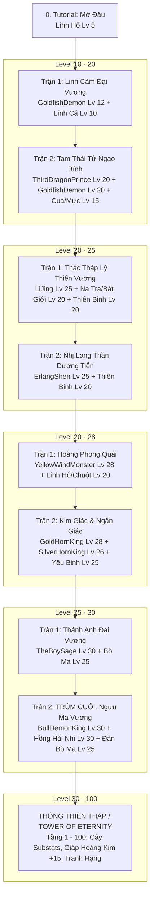

# TÀI LIỆU THIẾT KẾ TIẾN TRÌNH GAME & CÂN BẰNG TÀI NGUYÊN (GAME PROGRESSION & RESOURCE ECONOMY DESIGN)

---

## 🗺️ I. TỔNG QUAN TIẾN TRÌNH 4 VÙNG ĐẤT CỐT TRUYỆN (CAMPAIGN PROGRESSION)

Hệ thống cốt truyện được thiết lập chính xác theo lộ trình 4 Vùng Đất từ **Level 5 đến Level 30**:

---

## 📋 II. BẢNG CHI TIẾT CÁC MÀN ĐẤU & LEVEL QUÁI / BOSS

| Vùng Đất / Màn Đấu | Mã Trận Đấu | Slot & Kẻ Địch | Level Cụ Thể | Vai Trò / Phân Loại |
| :--- | :--- | :--- | :---: | :--- |
| **Tutorial** | `Tutorial_Default` | Slot 1, 2, 3: VanguardTiger | **Lv 5** | Lính Hổ mở đầu game |
| **Vùng 1: Đông Hải** | `Battle_GoldfishDemon` | • Slot 1, 2, 3: Benborba & Baborben • Slot 5: **GoldfishDemon** | **Lv 10** **Lv 12** | Lính Cá Hàng Trước **Boss Linh Cảm Đại Vương** |
| | `Battle_ThirdDragonPrince` | • Slot 1, 2, 3: CrabSolider & SquidSolider • Slot 4: **GoldfishDemon** • Slot 5: **ThirdDragonPrince** | **Lv 15** **Lv 20** **Lv 20** | Lính Cua / Mực Hộ Vệ Linh Cảm Đại Vương phụ công **Boss Tam Thái Tử Ngao Bính** |
| **Vùng 2: Thiên Đình** | `Battle_LiJing_Boss` | • Slot 3, 4, 6: HeavenlySoddier • Slot 1: **MarshalTianpeng** (Bát Giới) • Slot 5: **ThirdPrinceNezha_Boss** (Na Tra) • Slot 2: **LiJing_Boss** | **Lv 20** **Lv 20** **Lv 20** **Lv 25** | Thiên Binh Hộ Vệ Tướng Đỡ Đòn Sát Thủ Bạo Kích **Boss Thác Tháp Lý Thiên Vương** |
| | `Battle_ErlangShen_Boss` | • Slot 1, 2, 3: HeavenlySoddier • Slot 5: **ErlangShen_Boss** | **Lv 20** **Lv 25** | Thiên Binh Hộ Vệ **Boss Nhị Lang Thần Dương Tiễn** |
| **Vùng 3: Cao Lão Trang** | `Battle_YellowWindMonster` | • Slot 1, 2, 3: VanguardTiger & RatMonster • Slot 5: **YellowWindMonster** | **Lv 20** **Lv 28** | Lính Hổ & Chuột Tinh **Boss Hoàng Phong Quái** |
| | `Battle_GoldHornKing` | • Slot 1, 2, 3: Minions • Slot 4: **SilverHornKing** • Slot 5: **GoldHornKing** | **Lv 25** **Lv 26** **Lv 28** | Yêu Binh Hàng Trước Boss Phụ: Ngân Giác Đại Vương **Boss Chính: Kim Giác Đại Vương** |
| **Vùng 4: Hỏa Diệm Sơn** | `Battle_TheBoySage` | • Slot 1, 2, 3: YoungBufflalo • Slot 5: **TheBoySage** | **Lv 25** **Lv 30** | Đàn Bò Ma Hàng Trước **Boss Hồng Hài Nhi** |
| | `Battle_BullDemonKing` | • Slot 1, 3, 4, 6: YoungBufflalo • Slot 5: **TheBoySage** • Slot 2: **BullDemonKing_Boss** | **Lv 25** **Lv 30** **Lv 30** | Đàn Bò Ma Hộ Vệ Hồng Hài Nhi Phụ Công **TRÙM CUỐI: Ngưu Ma Vương** |

---

## 📊 III. BẢNG CÂN BẰNG TÀI NGUYÊN & TIẾN TRÌNH ĐỘT PHÁ (RESOURCE BALANCING)

### 1. Phân Tầng Đột Phá Nhân Vật (Ascension Tiers)
* **Tier 0 (Lv 1 - 20):** Áp dụng cho Tutorial, Vùng 1 (Đông Hải) và giai đoạn đầu Vùng 2.
* **Tier 1 (Lv 20 - 40):** Mở khóa khi đạt Level 20 để vượt qua Thiên Đình, Cao Lão Trang và Hỏa Diệm Sơn (Boss Lv 25 - 30).
* **Tier 2 - 4 (Lv 40 - 100):** Dành riêng cho chế độ **Thông Thiên Tháp (Endgame Tower)** và các Bản Mở Rộng tương lai.

### 2. Phân Bổ Cấp Trang Bị
* **Vùng 1 (Đông Hải - Lv 10-20):** Giáp Xanh / Tím (+0 ~ +3).
* **Vùng 2 (Thiên Đình - Lv 20-25):** Giáp Tím (+3 ~ +6), kích hoạt **Set 2 món**.
* **Vùng 3 (Cao Lão Trang - Lv 20-28):** Giáp Tím / Vàng (+6 ~ +9), kích hoạt **Set 4 món**.
* **Vùng 4 (Hỏa Diệm Sơn - Lv 25-30):** Giáp Hoàng Kim (+9 ~ +12), Set 4 món hoàn chỉnh.
* **Thông Thiên Tháp (Endgame - Lv 30-100):** Cường hóa Giáp +15, Tối ưu hóa Substats hoàn hảo.

---

*Tài liệu này được cập nhật chính xác và lưu trữ tại `Tool/note/GD_Progression_And_Boss_Design.md`.*
